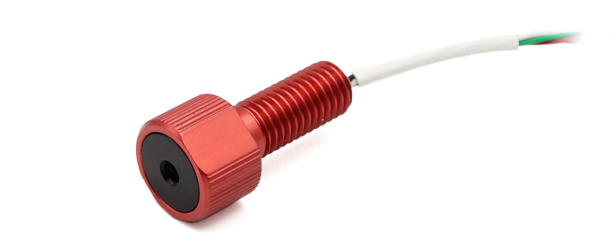

# Introduction

The <em>Bar02</em> is a shallow depth, ultra-high resolution, waterproof pressure and temperature sensor that comes in a Blue Robotics penetrator which provides a waterproof seal for your enclosure. This sensor measures depth of 0-10m with resolution of 0.16mm and altitude in air with a resolution of 13cm. 

## Quick Start

1. Download [MS5837 Arduino Library](https://github.com/bluerobotics/BlueRobotics_MS5837_Library).
2. Install software such as the [Example Code](#example-code) to your microcontroller.
3. Connect the DF13 or bare wires to the appropriate microcontroller pins, using a [logic level converter](/level-converter/#introduction) if your board has 5V logic:
  - Green: SCL (3.3V logic)
  - White: SDA (3.3V logic)
  - Red: +2.5-5.5V
  - Black: Ground

# Specifications

## Schematic

The [EagleCAD files](https://github.com/bluerobotics/Bar30-Pressure-Sensor) for the schematic and board are available on our [GitHub page](https://github.com/bluerobotics). This board uses the same schematic as the Bar30 sensor but the sensor chip is replaced with MS5837-02BA.

[Bar30/Bar02 Schematic.png](/bar30/cad/BAR30-SENSOR-Schematic.png)

## Specification Table

For further information please see the [MS5837-02BA Data Sheet](http://www.te.com/commerce/DocumentDelivery/DDEController?Action=srchrtrv&DocNm=MS5837-02BA01&DocType=Data+Sheet&DocLang=English&DocFormat=pdf&PartCntxt=CAT-BLPS0059).

|      **Electrical**       |
| ------------- | --------- |
| **Item** | **Condition** | **Value** |
| Supply Voltage| -- | 2.5-5.5 volts |
| I2C Logic Voltage (SDA and SCL) | -- | 2.5 - 3.6 volts |
| Peak Current   | -- | 1.25 mA   |
| ------------- | --------- |
|                **Pressure**                  		 |
| ------------- | ---------------------------------- |
| **Item** | **Condition** | **Value** |
| Maximum Mechanical Pressure | -- | 10 bar |
|Standard Operating Pressure| -- | 0.3-1.2 bar |
|Extended Operating Pressure| -- |0-2 bar [up to 33 ft (10 m) in water]|
|Absolute Accuracy | From 600-1000 mbar (20&deg;C) | +/- 0.5 mbar |
|  				         | From 300-1100 mbar (0-60&deg;C) | +/- 2 mbar (2 cm in freshwater) |
|	        			   | From 300-1000 mbar (-20-85&deg;C| +/- 4 mbar (4 cm in freshwater) |
| ---------------- | ------------------------------- |
|            **Temperature**            			 |
| ------------- | ------------- | ------------- |
| **Item** | **Condition** | **Value** |
| Operating Temperature | -- | -20 to +85&deg;C |
| Storage Temperature | -- | -40 to +85&deg;C |
| Absolute Accuracy   | From 300-1100 mbar at -20-85&deg;C | +/- 2&deg;C |
|  **Physical**  |
| Wire Colors | Green - I2C Clock (SCL, 3.3V) |
|             | White - I2C Data (SDA, 3.3V) |
|             | Red - Positive (2.5-5.5V) |
|             | Black - Ground          |
| ------------|-------------------------|
| Overall Length | 37 mm |
| Thread Size    | M10x1.5 20 mm threaded |
| Recommended Through Hole Size | 10-11 mm |
| Wrench Flats | 16 mm |
|----------------------|

## DF13 Pinout

| 1 &Delta; |  Red - Positive (3.3-5.5V) |
| 2 |  Green - I2C Clock (SCL) |
| 3 |  White - I2C Data (SDA)  |
| 4 |  Black - Ground          |

**Mating Connector:** [Hirose 4-pos DF13 on Digi-Key](http://www.digikey.com/product-detail/en/DF13-4P-1.25DSA/H2193-ND/241767)

## 2D Drawing

## 3D Model

All 3D models are provided in zip archives containing the follow file types:

- SolidWorks Part (.sldprt)
- IGES (.igs) 
- STEP (.step)
- STL (.stl)

|		**Bar02/Bar30 Pressure Sensor**																						|
| --------------------------------------------------------------------------------------------- |
| Bar02/Bar30 Pressure Sensor    | [BAR30-PRESSURE-SENSOR-R1.zip](/bar30/cad/BAR30-PRESSURE-SENSOR-R1.zip) |
| Bar02/Bar30 Penetrator Nut		 | [PENETRATOR-M-NUT-10-A-R2.zip](http://www.bluerobotics.com/models/PENETRATOR-M-NUT-10-A-R2.zip)|

# Installation

## Step 1: Lubricating the O-ring

Use a small amount of silicone grease on the O-ring for lubrication and place it in the groove of the Bar02 Pressure Sensor. 

## Step 2: Installation

Install the Bar02 Pressure Sensor into an endcap and tighten by hand or with a wrench.

# Example Code

## Arduino

This example uses the [BlueRobotics MS5837 Library](https://github.com/bluerobotics/BlueRobotics_MS5837_Library) with the connected sensor. The example reads the sensor and prints the resulting values to the serial terminal.

Please remember to use a logic level converter, such as [this one](http://bluerobotics.com/store/electronics/level-converter-r1/), to convert Arduino 5V levels to 3.3V!

If you've never used Arduino before, we suggest checking out [some tutorials](https://www.arduino.cc/en/Tutorial/HomePage)!

~~~~~~~~~~ cpp
#include <Wire.h>
#include "MS5837.h"

MS5837 sensor;

void setup() {
  
  Serial.begin(9600);
  
  Serial.println("Starting");
  
  Wire.begin();

  sensor.setModel(MS5837::MS5837_02BA);
  sensor.init();
  
  sensor.setFluidDensity(997); // kg/m^3 (997 freshwater, 1029 for seawater)
}

void loop() {

  sensor.read();

  Serial.print("Pressure: "); 
  Serial.print(sensor.pressure()); 
  Serial.println(" mbar");
  
  Serial.print("Temperature: "); 
  Serial.print(sensor.temperature()); 
  Serial.println(" deg C");
  
  Serial.print("Depth: "); 
  Serial.print(sensor.depth()); 
  Serial.println(" m");
  
  Serial.print("Altitude: "); 
  Serial.print(sensor.altitude()); 
  Serial.println(" m above mean sea level");

  delay(1000);
}
~~~~~~~~~~~~~~~~

## Python

This example uses the [BlueRobotics MS5837 Python Library](https://github.com/bluerobotics/ms5837-python) with the sensor connected to a Raspberry Pi. The Raspberry Pi uses 3.3V logic levels on the I2C pins, so a logic level shifter is not required.

~~~~~~~~~~ cpp
import ms5837
import time

sensor = ms5837.MS5837_02BA() # Default I2C bus is 1 (Raspberry Pi 3)

# We must initialize the sensor before reading it
if not sensor.init():
        print "Sensor could not be initialized"
        exit(1)

# Print readings
while True:
        if sensor.read():
                print("P: %0.1f mbar  %0.3f psi\tT: %0.2f C  %0.2f F") % (
                sensor.pressure(), # Default is mbar (no arguments)
                sensor.pressure(ms5837.UNITS_psi), # Request psi
                sensor.temperature(), # Default is degrees C (no arguments)
                sensor.temperature(ms5837.UNITS_Farenheit)) # Request Farenheit
        else:
                print "Sensor read failed!"
                exit(1)
~~~~~~~~~~~~~~~~
