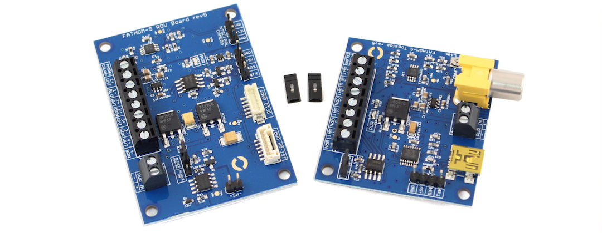

# Installation

## To Pixhawk

To connect to a Pixhawk autopilot, use the DF13 cable included with the Pixhawk to connect the `DF13 UART` connector on the Fathom-S ROV board to the `Telem1` connector on the Pixhawk. Note that you must power the Pixhawk with the Pixhawk power module or another method as the Fathom-S board cannot supply sufficient power.

## To Arduino

To connect to an Arduino, using the header pins on the Fathom-S board and connect the following:

* Fathom-S `RX` to Arduino `RX`
* Fathom-S `TX` to Arduino `TX`
* Fathom-S `5V` to Arduino `5V`
* Fathom-S `GND` to Arduino `GND`

## Video Gain Adjustment

The video gain potentiometer allows the video receiver gain to be adjusted for different tether lengths. This makes a relatively minor difference in video quality but is noticeable over widely different lengths.

The potentiometer can be adjusted for gain suitable for 10m length to 700m length.

# Advanced

## Arduino Programming

The *Fathom-S* board includes features to allow an Arduino microcontroller to be programmed through a tether. To enable that feature:

1. Install the `RTS RESET JMPR` on the topside board

2. Make sure the ROV board has a jumper installed for `TETHER PWR-SW`

3. Connect the Arduino serial port to the tether board via the `GND`, `+5V`, `RX`, and `TX` pins. Make sure the Arduino is *only* powered via the tether board. This is required so that it will reset when the tether board resets.

4. Select the appropriate serial port in the Arduino IDE and program like normal!

## Spare Twisted Pair

In some applications, an addition twisted pair may be needed from the tether for other devices. In this case, you can disconnect Pair 4 from the tether boards and use it for other applications. This will disable the power-on feature so `ALWAYS ON` jumper must be installed.

## Connecting Relay or Switch

The *Fathom-S* board includes logic to turn itself on through the tether connection. This can also be used to turn on an entire ROV by powering a relay or MOSFET switch. The `SW` pins provide a switched battery connection for this purpose.
