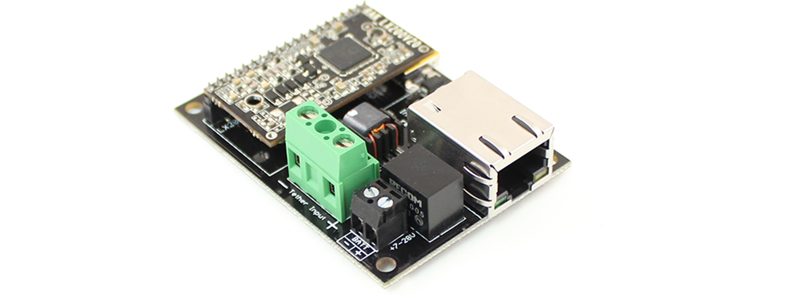

# Introduction

The *Fathom-X* Tether Interface Boards provide a high-speed, long-distance Ethernet connection to an ROV or other remote platform. They're designed for use with the [Fathom tether](http://bluerobotics.com/store/parts/cables/fathom-tether-nb-4p-26awg-r1/), standard Cat5 cable, or even a single twisted pair of wires. This board uses the [Rak Wireless LX200V20 module](http://bluerobotics.com/store/electronics/lx200v20-module-r1/), which leverages the robust HomePlug AV (IEEE-1901) standard for sending Ethernet through powerlines.

The *Fathom-X* board is also part of the *Advanced ROV Electronics Package* and works well in conjunction with the Raspberry Pi, Pixhawk, and [ArduSub Control Software](http://ardusub.com/).

## Features 

* 80 Mbps  Ethernet over two wires (per our own bandwidth testing)
* 300m+ tether length capability (published capability of 2000m)
* Plug-and-play with no setup involved
* Onboard switching power supply with 7-28V input range
* USB Mini-B connector for powering directly from a computer on the topside
* Indicator LEDs for power, link, and data
* Included 6" Ethernet cable for connection to onboard computer

## Quick Start

1. Connect two wires from the tether cable to the terminal block
2. Power each board with either a USB connection or a 7-28V input to the small terminal block
3. Connect an Ethernet cable and the connection should become active immediately

# Specifications

## Function Diagram

## Specification Table

| **Item** | **Condition** | **Value** |
| ------------- | --------- |
|      **Electrical**       |
| ------------- | --------- |
| Supply Voltage| Terminal Block | 7-28 volts |
| Supply Voltage| USB | 5 volts |
| Max Power Draw | -- | 2.5 Watts |
| ------------- | --------- |
|                **Performance**                  		 |
| ------------- | ---------------------------------- |
| Max Practical Bandwidth        |        | 80 Mbps |
| Physical Layer Bandwidth       |        | 200 Mbps |
| Working Frequency              |        | 2-30 MHz |
| Max Tether Length (Published)  |        | 2000 m   |
| Max Tether Length (Tested)  |           | 300 m    |
| ---------------- | ------------------------------- |
|  **Physical**  |
| ------------- | ------------- | ------------- |
| Operating Temperature | | -20 to +85&deg;C |
| Storage Temperature | | -40 to +85&deg;C |
| USB Connector Type | | USB Mini B Female |
| Tether Wire Gauge | | 12-30 AWG |
| Power Wire Gauge | | 16-26 AWG |
| Dimensions                     | | 64 x 46 mm |
| Screw Hole Spacing             | | 57 x 40 mm |
| Screw Hole Diameter | | 3.3 mm |
|----------------------|

## Schematic

The [EagleCAD files](https://github.com/bluerobotics/fathom-x/) for the schematic and board are available on our [GitHub page](https://github.com/bluerobotics).

# Installation

## Normal Scenario

In most cases, the Fathom-X setup is simple. Once powered, it acts as a transparent Ethernet bridge to extend any Ethernet connection through the tether. 

The four screw holes are identical to those on the Fathom-S ROV board, so they can be interchanged quickly.

## With Fathom-S

The Fathom-X board can be use with the Fathom-S board to provide the features of both, simultaneously. Additionally, the screw hole pattern is identical so that they can be stacked together with stand-offs.

The use both board together:

1. Connect the tether wires to the Fathom-S board normally.

2. Add jumpers between "Pair 4" on the Fathom-S board and the large terminal block on Fathom-X. Connect 4+ to "+" on the terminal block and 4- to "-" on the terminal block.

3. That's it, both boards will function normally, including the power on/off feature of the Fathom-S board.