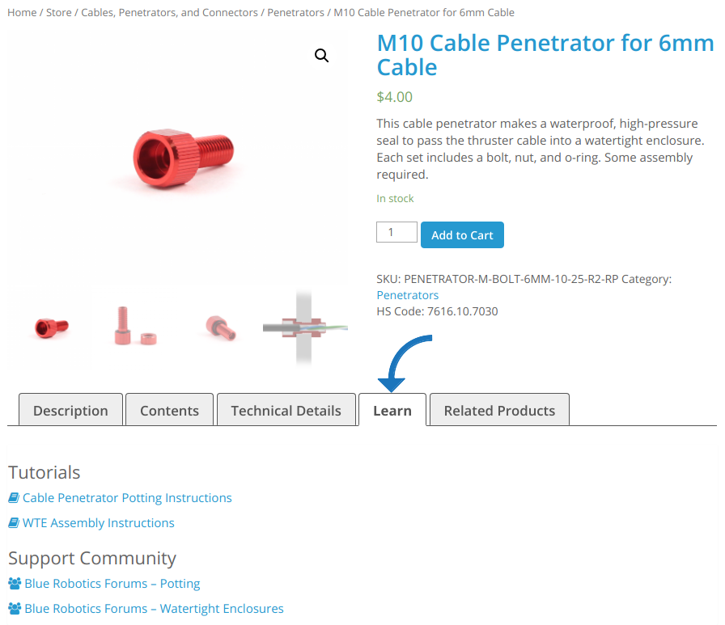

# Blue Robotics Documentation

<i class="fa fa-exclamation-triangle"></i>NOTICE!!!<i class="fa fa-exclamation-triangle"></i>

Blue Robotics product documentation is in the process of being restructured! Most product specifications, 2D drawings, and 3D models have been moved to their respective product pages.
All the tutorials and manuals along with support information can be found on the <em>Learn</em> tab of each product store page.

You can [contribute, point out errors, and make suggestions](#how-to-contribute) to help us improve the documentation.

# How to Contribute

Want to help us improve our documentation? There are several way to help out.

This page is hosted by and version-controlled through Github.com. Check out the repository here: [github.com/bluerobotics/bluerobotics.github.io](http://github.com/bluerobotics/bluerobotics.github.io).

* **Issues.** You can submit issues like errors, missing content, etc. via Github's issue reporting tools

* **Contribution.** If you are interested in writing larger sections of documentation including new pages, tutorials, etc. you should make a [fork](https://github.com/bluerobotics/bluerobotics.github.io) of this repository, write your content, and then ask us to [pull](https://github.com/bluerobotics/bluerobotics.github.io/pulls) that content into the main repository.

[Here is an example page](/example/) showing what formatting is possible using the Markdown text format.

[Here is a short tutorial](/jekyll-tutorial/) showing how to edit the documentation locally and push changes to your fork.

**The current build status of the documentation is:**

# License

The Blue Robotics Documentation is licensed under a [Creative Commons Attribution-ShareAlike 4.0 International License](http://creativecommons.org/licenses/by-sa/4.0/).
