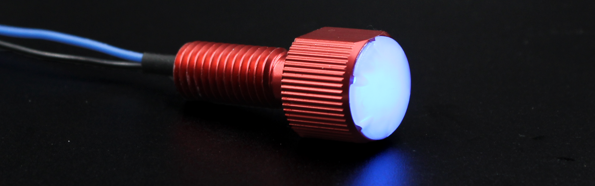
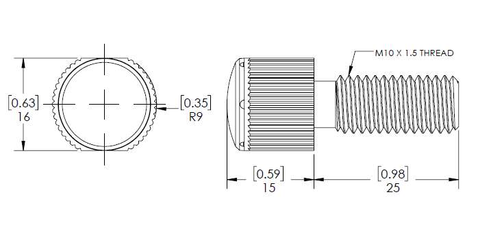

# Introduction

The Subsea LED Indicator is a simple LED light with high pressure capability! It comes in a penetrator form factor for easy installation on any of our Watertight Enclosures and it comes in four colors: white, blue, green, and red! It operates on 3-20v and each light draws up to 30mA when used at 20v. A built-in resistor makes it easy to use without any additional parts.

## Quick Start

1. Connect the wires to a power source
  - White/Red/Green/Blue Wire: +3-20 volts (DC)
  - Black Wire: Ground

# Specifications

## Specification Table

|      **Electrical**       |
| ------------- | --------- |
| **Item** | **Value** |
| Supply Voltage (Vin) | 3 - 20 volts (DC) |
| Max Current | TBD mA |
| ------------- | --------- |
|   **Light**    |
|--------------|--------------|
| Maximum Brightness | TBD mcd |
|  **Cable and Connectors**  |
| Cable Length | 180 mm | 7 in |
| Connectors | Single 0.1" Male Header Pins |
| Wires | Black - Ground |
| | White/Red/Green/Blue - Power |
|  **Physical**  |
| ------------|-------------------------|
| Pressure Rating | TBD m | TBD ft |
| Mounting Hole Diameter | 10 mm | 0.40 in |
|----------------------|

## 2D Drawings

## 3D Model

All 3D models are provided in zip archives containing the follow file types:

- SolidWorks Part (.sldprt)
- IGES (.igs) 
- STEP (.step)
- STL (.stl)

|		**Lumen Light**																			|
| --------------------------------------------------------------------------------------------- |
| Indicator Assembly      | [INDICATOR10-ASM-R1.zip](INDICATOR10-ASM-R1.zip)    |
| Cable Penetrator Nut    | PENETRATOR-NUT-10-A-R2.zip [Coming Soon] 

# Installation

To install the indicator, lightly grease the provided O-ring with silicone grease and install over the cable and bolt. Insert to a 10mm hole and tighten the nut to secure the indicator. We recommend using a penetrator wrench to ensure it's securely tightened.

# Example Code

## Arduino

This example uses the Arduino Servo library to control the light brightness. This can use any pin on the Arduino board as the "indicatorPin". Note that the dimming functionality will only work on a PWM pin.

If you've never used Arduino before, we suggest checking out [some tutorials!](https://www.arduino.cc/en/Tutorial/HomePage)

~~~~~~~~~~ cpp
byte indicatorPin = 9;

void setup() {
	// set up pin mode
  pinMode(indicatorPin,OUTPUT);
}

void loop() {
  // turn light on
  digitalWrite(indicatorPin,HIGH);

  // wait one second
  delay(1000);

  // turn light off
  digitalWrite(indicatorPin,LOW);

  // wait one second
  delay(1000);

  // turn light on, 50% power
  analogWrite(indicatorPin,127); // values from 0-255

  // wait one second
  delay(1000);
}
~~~~~~~~~~~~~~~~
