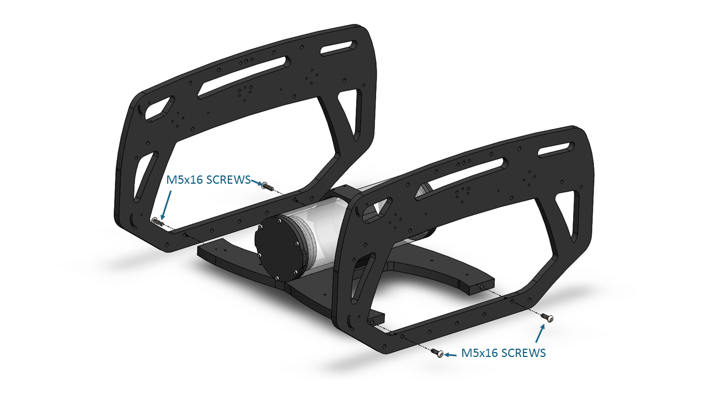

# Introduction

The **BlueROV** is an unassembled ROV kit with frame, watertight enclosure, thrusters, and speed controllers. Hardware/software experience required. It uses six thrusters to provide six-degree-of-freedom control allowing you to point the ROV in any orientation to film anything, grab anything with a simple robot arm, and have a lot of fun! 

## Safety 

<i class="fa fa-exclamation-triangle fa-fw fa-2x text-warning"></i> When working with electricity, especially in water, always practice caution. Always ensure that connections are secure and watertight. Keep your body away from spinning motors and propellers.

# What's Included

## Frame

Quantity      | Part
------------- | --------------------------------------------------------
2             | Front Center Panel (1/2" thick black HDPE)                       
2             | Rear Center Panel (1/2" thick black HDPE)                       
1             | Bottom Panel (1/2" thick black HDPE)                         
2             | Side Panel (3/8" thick black HDPE)                       
2             | Electronics Enclosure Cradle (Black Anodized Aluminum)  
8 			  | M4x18 Button Head Cap Screw (316 Stainless Steel)                    
12            | M5x16 Button Head Cap Screw (316 Stainless Steel)             
6             | 8-16 Thread, 5/8" Long, Thread-Forming Screw                                          
6             | 200g Ballast 

## Electronics Enclosure                                                         

Quantity      | Part
------------- | --------------------------------------------------------
1             |                                           
6             |                                           
24            |                     

## Battery Enclosure

Quantity      | Part
------------- | --------------------------------------------------------
2             | Battery Enclosure Cradle (Black Anodized Aluminum w/ rubber strip)          
1             |                              
1             |          
2             |                             
4             |                                      
12            |                            

## Thrusters

Quantity      | Part
------------- | --------------------------------------------------------
6   		  | T200 Thrusters w/ installed penetrator
24            | M3x16 Socket Head Cap Screw (316 Stainless Steel)                                  

## Fairings

Quantity      | Part
------------- | --------------------------------------------------------
4             | Fairings (Blue Polycarbonate)                    
4             | Buoyancy Foam ()                        
16            | #4 Size, 3/4" Long Pan Head Self Tapping Screw (316 Stainless Steel)                                   

## Tether

Quantity      | Part
------------- | --------------------------------------------------------
1             | Fathom Tether                               
1             | Fathom Thimble                          
5             | Heavy Duty Zip Ties               
 
## Tools                                                      

Quantity      | Part
------------- | --------------------------------------------------------
1             | Silicone Grease Tube 
1             | O-Ring Pick   
1             | 1.5mm Hex Key
1             | 2mm Hex Key
1             | 2.5mm Hex Key
1			  | 3mm Hex Key                  

**Tools Needed:**

* 2mm Hex Driver
* 2.5mm Hex Driver
* Flathead Screwdriver
* Phillips screwdriver
* Knife or Scissors
* Syringe with Luer Tip
* Wire cutters
* Wire Strippers
* Thread locker (we recommend loctite 243)

# Assembly

## Installing the Battery Enclosure onto the Bottom Panel

1. Take one battery cradle and apply several drops of threadlocker to the bottom third of the screw holes on the bottom of the cradle. 

	picture of threadlocker being put in the bottom of the cradle

2. Attach that battery cradle to the bottom panel, using M4x14 socket head cap screws. Be sure that the screw head is in the counterbore. 

	

3. Apply several drops of threadlocker to the end of 4 M3x12 screws.

	Picture of threadlocker being applied to the screws

4. Install the 4 M3x12 screws into the cradle to clamp the battery enclosure into place.

	
	
## Frame

1. Apply several drops of threadlocker to the end of 8 M4x18 screws.

	Picture of threadlocker being applied to the screws
	
2. Attach the electronics enclosure cradle to the rear center panels. 

	
	
3. Attach the electronics enclosure cradle to the front center panels.

	
	
4. Apply several drops of threadlocker to the end of the 12 M5x16 screws.

	Picture of threadlocker being applied to the screws.

5. Install the side panels to the bottom panel.

	
	
6. Install the center panel assemblies to the side panels.

	
	
Now your ROV should look like the picture below, and it is time to move on to setting up your electronics enclosure.

	
## Electronics Enclosure

The electronics enclosure ships partially assembled, and will arive looking like this.

1. Remove the tube from the rear flange. You can twist a screwdriver in the slots if it does not pull off easily.

	

2. Remove the rear 14 hole end cap by removing the screws using a M2.5 Allen key. Place the M3x12 screws and the clips in a safe place. 

	
	
3. Connect the ESC power wires to the power terminals

4. Connect the ESC motor wires to the motor wire terminals.

5. Attach your autopilot/computer.

6. 	Attach your tether board.

7. Attach the tether board power jumpers to the power terminal blocks and the tether board

7. Cut the 5V line on 5 of the ESC signal wires, then connect your ESC signal wires to your autopilot. 

8. Attach your camera wire to the tether board

9. Connect your camera servo signal wire to your autopilot

10. Apply silicone grease to nine 013 O-rings, then install them onto the 6 T200 penetrators, the Lumen Light penetrator, the Fathom Tether penetrator, and the power cable penetrator (side without bullet connectors), 
	
11. Install the T200 Thrusters, Lumen Lights, Fathom Tether, and power cable penetrators into the end cap as shown below, using two 16mm open end wrenches. 
You should tighten the penetrators finger tight plus ~1/16 of a turn. To make sure that the penetrators are tight enough, try to loosen them with your fingers after tightening. If you can't loosen them they are tight enough.

12. Reinstall the end cap onto the electronics enclosure, using the screws, clips, and M2.5 Allen key from step 2.

13. Connect the Bar30 signal wire to the I2C port on your autopilot.

14. Connect the power wires to the power terminal blocks.

15. Connect the Lumen light signal wire to your autopilot and the Lumen light power and ground wires to the power terminals.

15.  Connect your motor wires to the motor wire terminal

## Electronics Tray

1. 

